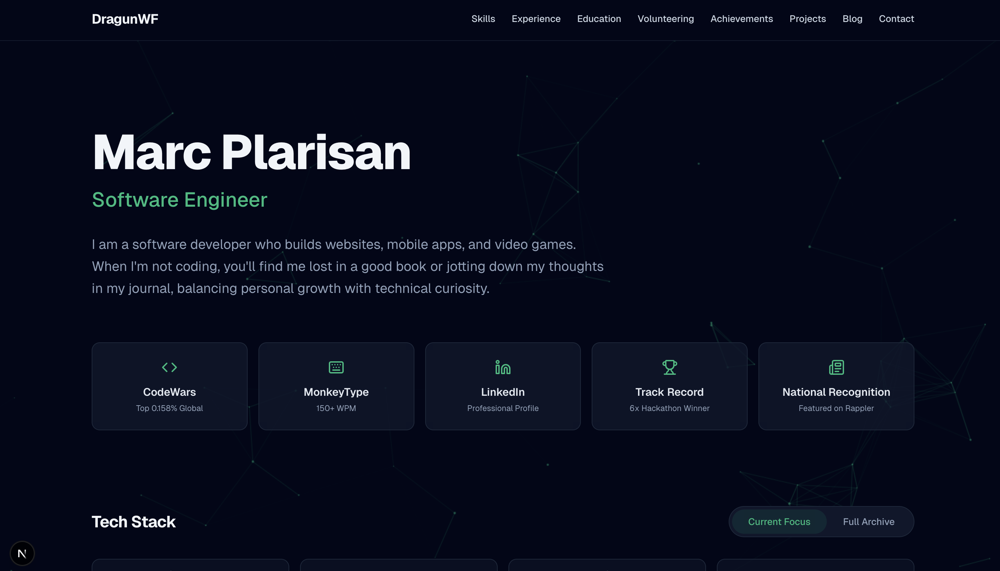
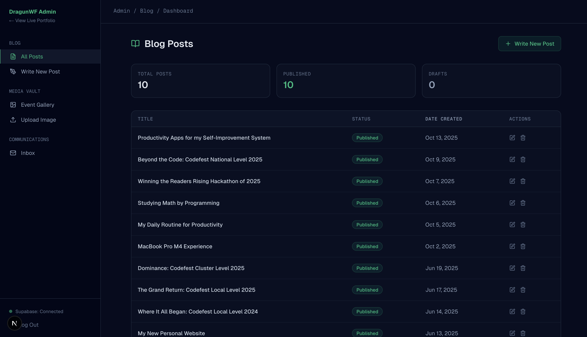
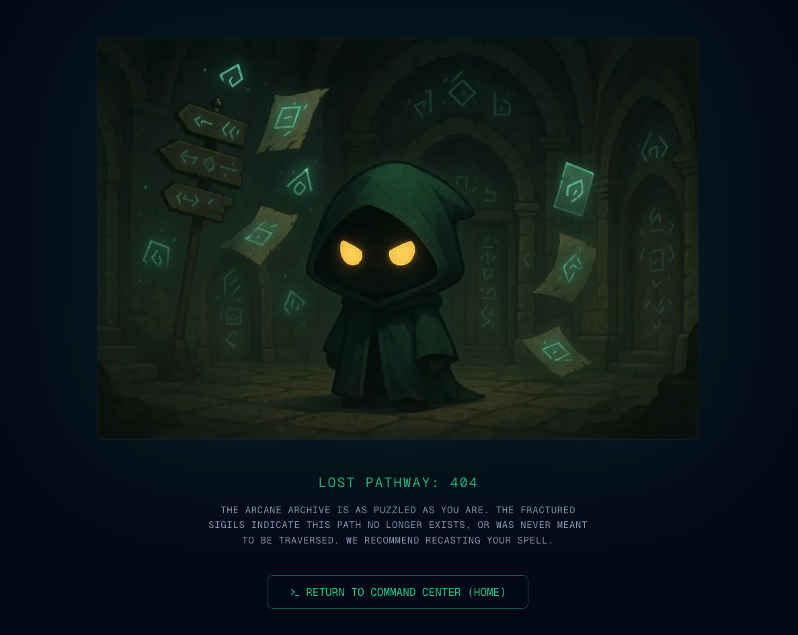

# Portfolio Website

[](https://nextjs.org/)
[](https://www.typescriptlang.org/)
[](https://tailwindcss.com/)
[](https://supabase.com/)
[](https://www.prisma.io/)

Welcome. While my previous sites like the DragunWF website as personal hubs for my creative interests and hobbies, this platform is my dedicated professional headquarters. It marks a shift in focus, designed specifically to showcase my technical expertise, software development projects, and career milestones."

---

## 🔮 The Vision

Built with the **Next.js App Router** and **TypeScript**, this portfolio prioritizes logical, scalable system design. It features a custom interactive canvas background (Arcane Constellation) and a clean-core architecture that separates public concerns from secure administrative logic.

## 🛠 Tech Stack

- **Framework**: Next.js 15 (App Router)
- **Styling**: Tailwind CSS 4 (Custom Emerald Glow System)
- **Database**: PostgreSQL via Supabase
- **ORM**: Prisma
- **Animations**: Framer Motion
- **Icons**: Lucide React

---

## 📸 Screenshots

### 🖥 Public Portfolio



### 🔐 Admin Sanctuary



### 🔍 Custom 404 Page



---

## 🚀 Setup & Installation

Follow these steps to manifest the project in your local environment:

### 1. Prerequisites

- Node.js (Latest LTS)
- npm / pnpm / yarn
- A Supabase Project (PostgreSQL)

### 2. Clone the Repository

```bash
git clone https://github.com/DragunWF/Portfolio-Website.git
cd Portfolio-Website
```

### 3. Install Dependencies

```bash
npm install
```

### 4. Environment Configuration

Create a `.env.local` file in the root directory and populate it with your secrets:

```env
# Prisma Connection
DATABASE_URL="your_postgresql_connection_string"
DIRECT_URL="your_direct_postgresql_connection_string"

# Supabase Auth/Storage
SUPABASE_URL="your_supabase_project_url"
SUPABASE_KEY="your_supabase_service_role_key"
```

### 5. Database Synchronization

Generate the Prisma client and push the schema to your database:

```bash
npx prisma generate
npx prisma db push
```

### 6. Ignition

Launch the development server:

```bash
npm run dev
```

The portal will be accessible at `http://localhost:3000`.

---

## 📜 Repository Structure

- `app/(portfolio)`: Public-facing routes and components.
- `app/(admin)`: Secure CMS dashboard logic.
- `app/_components`: Reusable UI primitives and section components.
- `constants`: Centralized data store for the "Clean Core" pipeline.
- `prisma`: Database schema and migration history.
- `docs`: Documentation assets and screenshots.

---

**Built with 💚 and Arcane Energy by Marc Plarisan.**
